<div align="center">
  <p style="font-size: 32px; font-weight: bold;">DS200.Q21 - Bài thực hành 2</p>
  <p style="font-size: 20px;">MSSV: 23520519</p>
</div>

---


## Bài 1

- Chạy lần lượt các lệnh sau:
    ```
    cd "/mnt/d/UIT/DS200_Materials/Assignment/Lab02/Bai1"
    pig -x local Code/Bai1.pig
    ```

    <div align="center">
        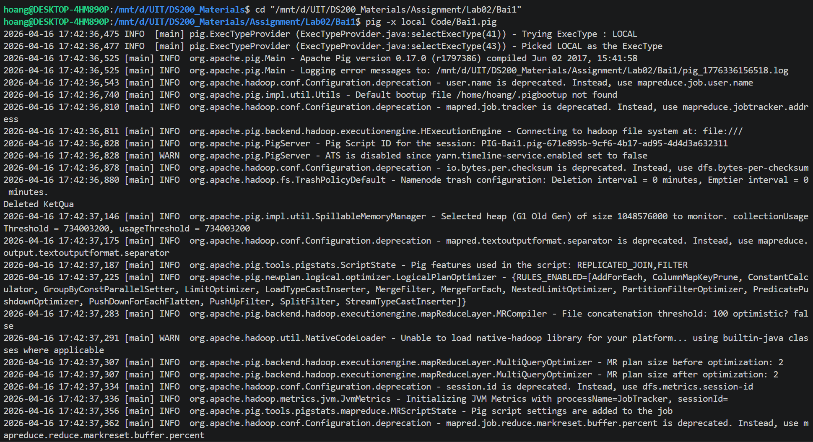
        <br>
        <i>Terminal khi chạy lệnh chứa thông tin user - Ảnh 1 </i>
    </div>

    <br>

    <div align="center">
        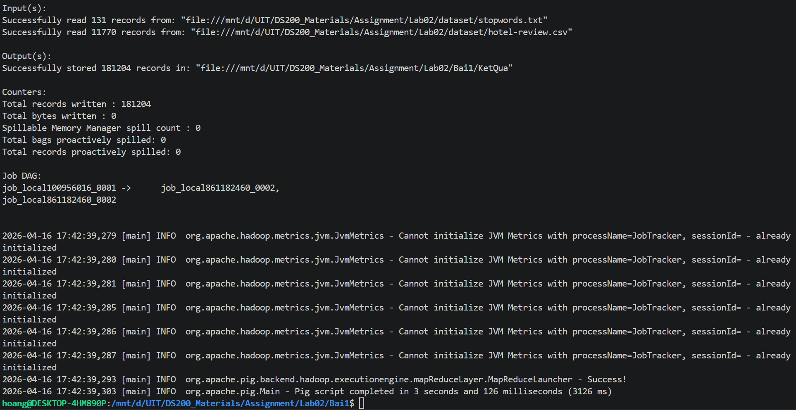
        <br>
        <i>Terminal khi chạy lệnh chứa thông tin user - Ảnh 2 </i>
    </div>

- Kết quả:
    <div align="center">
        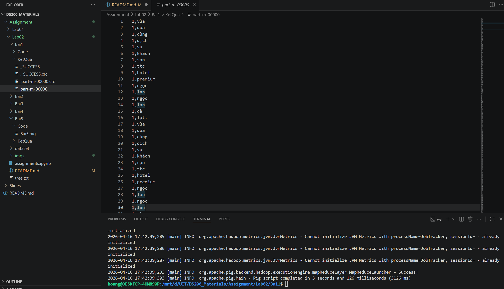
    </div>


## Bài 2

- Chạy lần lượt các lệnh sau:
    ```
    cd "/mnt/d/UIT/DS200_Materials/Assignment/Lab02/Bai2"
    pig -x local Code/Bai2.pig
    ```

    <div align="center">
        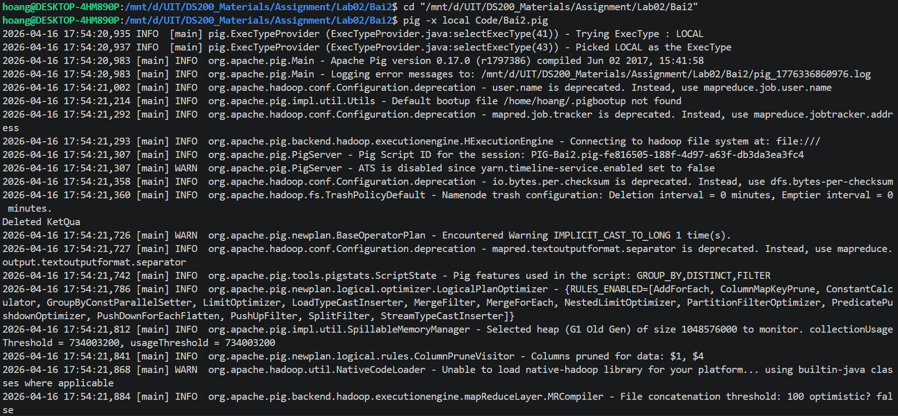
        <br>
        <i>Terminal khi chạy lệnh chứa thông tin user - Ảnh 1 </i>
    </div>

    <br>

    <div align="center">
        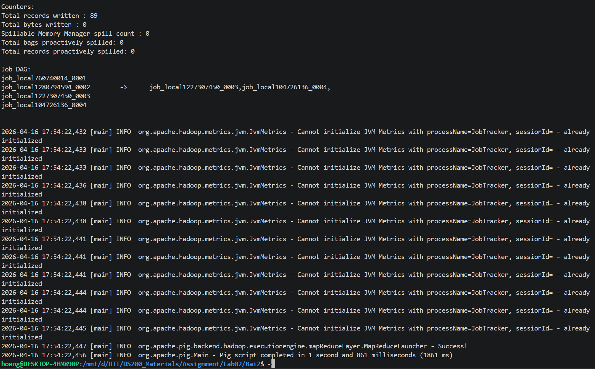
        <br>
        <i>Terminal khi chạy lệnh chứa thông tin user - Ảnh 2 </i>
    </div>

- Kết quả:
    - Thống kê tần số xuất hiện của các từ. Chỉ ra các từ xuất hiện trên 500 lần:
        <div align="center">
            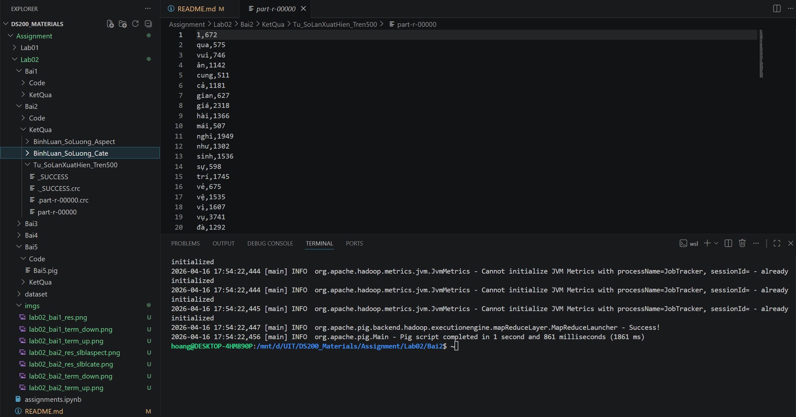
        </div>

    - Thống kê số bình luận theo từng phân loại (category):
        <div align="center">
            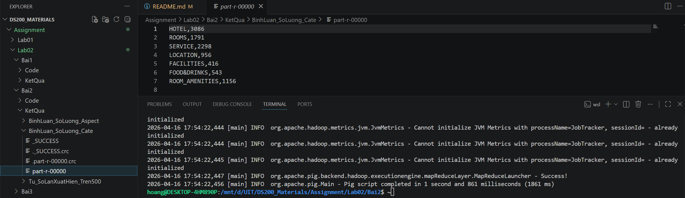
        </div>

    - Thống kê số bình luận theo từng khía cạnh đánh giá (aspect):
        <div align="center">
            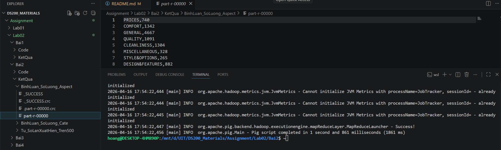
        </div>


## Bài 3

- Chạy lần lượt các lệnh sau:
    ```
    cd "/mnt/d/UIT/DS200_Materials/Assignment/Lab02/Bai3"
    pig -x local Code/Bai3.pig
    ```

    <div align="center">
        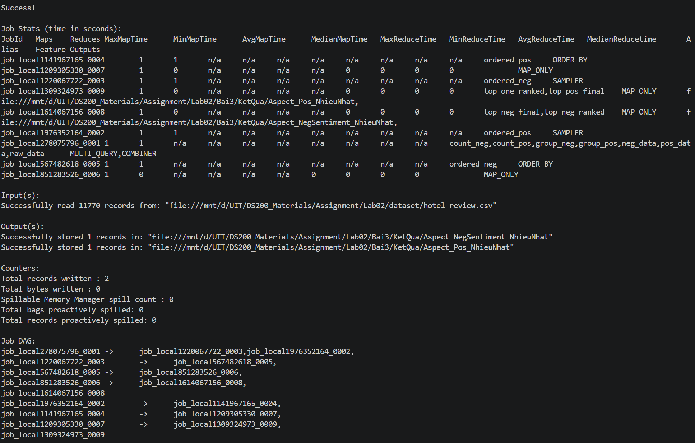
        <br>
        <i>Terminal khi chạy lệnh chứa thông tin user - Ảnh 1 </i>
    </div>

    <br>

    <div align="center">
        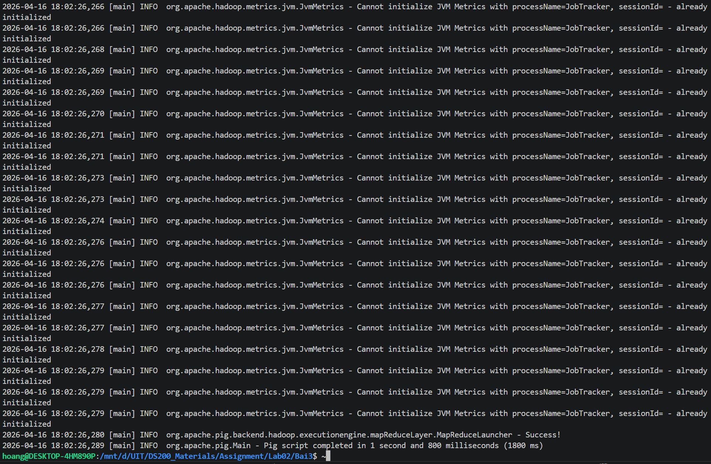
        <br>
        <i>Terminal khi chạy lệnh chứa thông tin user - Ảnh 2 </i>
    </div>

- Kết quả:

    - Xác định khía cạnh nào nhận nhiều đánh giá tiêu cực (negative) nhất:
        <div align="center">
            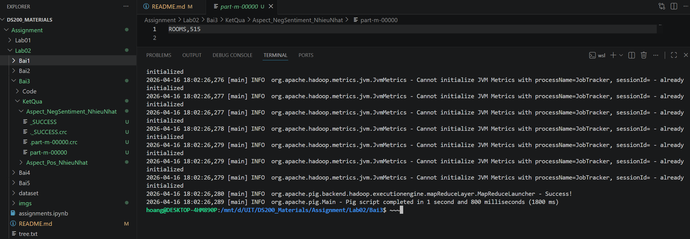
        </div>

    - Xác định khía cạnh nào nhận nhiều đánh giá tích cực nhất (positive) nhất:
        <div align="center">
            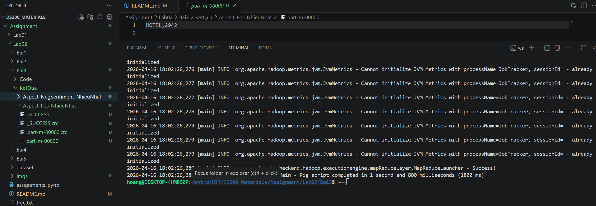
        </div>


## Bài 4

- Chạy lần lượt các lệnh sau:
    ```
    cd "/mnt/d/UIT/DS200_Materials/Assignment/Lab02/Bai4"
    pig -x local Code/Bai4.pig
    ```

    <div align="center">
        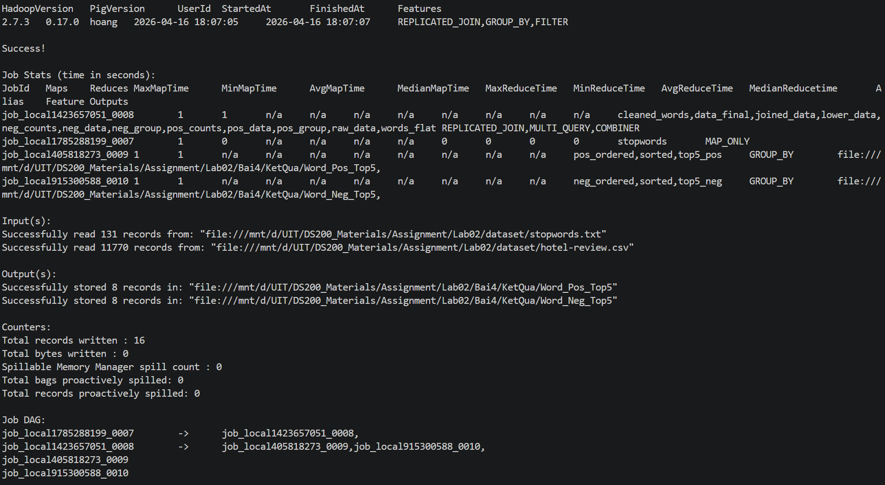
        <br>
        <i>Terminal khi chạy lệnh chứa thông tin user - Ảnh 1 </i>
    </div>

    <br>

    <div align="center">
        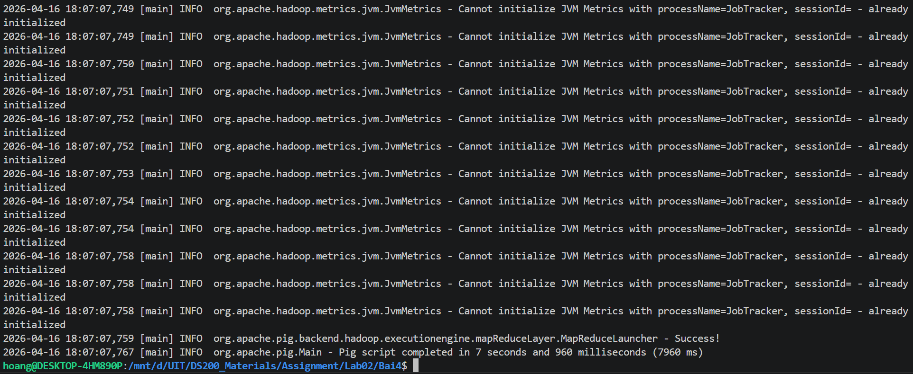
        <br>
        <i>Terminal khi chạy lệnh chứa thông tin user - Ảnh 2 </i>
    </div>

- Kết quả:
    - Dựa vào từng phân loại bình luận, hãy xác định **5 từ** mang ý nghĩa tích cực nhất:
        <div align="center">
            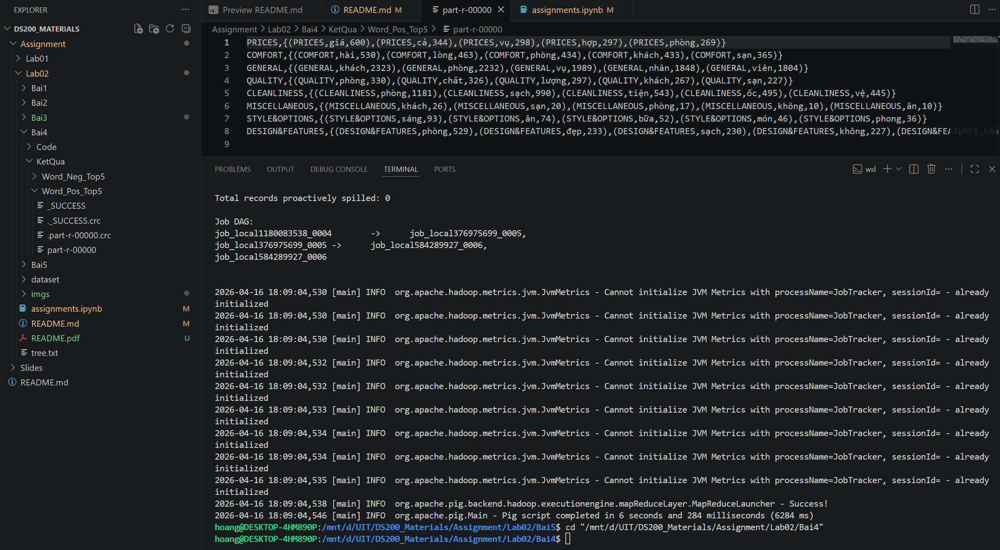
        </div>
    - Dựa vào từng phân loại bình luận, hãy xác định **5 từ** mang ý nghĩa tiêu cực nhất:
        <div align="center">
            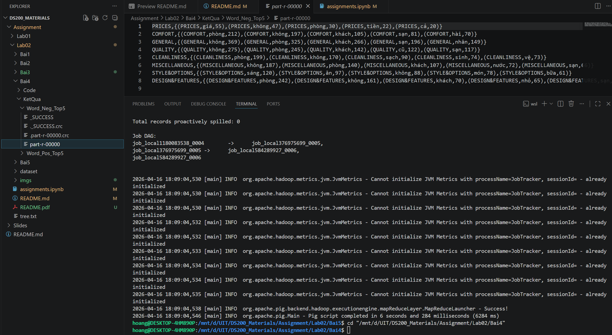
        </div>


## Bài 5

- Chạy lần lượt các lệnh sau:
    ```
    cd "/mnt/d/UIT/DS200_Materials/Assignment/Lab02/Bai5"
    pig -x local Code/Bai5.pig
    ```

    <div align="center">
        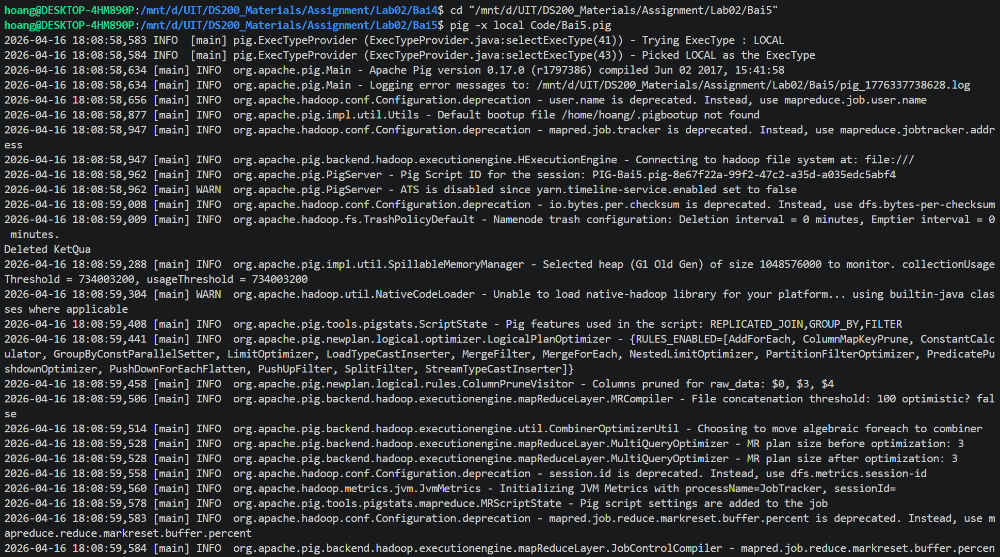
        <br>
        <i>Terminal khi chạy lệnh chứa thông tin user - Ảnh 1 </i>
    </div>

    <br>

    <div align="center">
        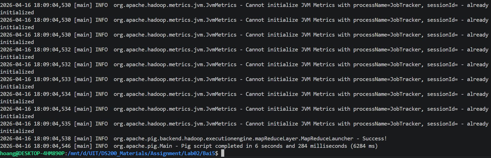
        <br>
        <i>Terminal khi chạy lệnh chứa thông tin user - Ảnh 2 </i>
    </div>

- Kết quả:
<div align="center">
    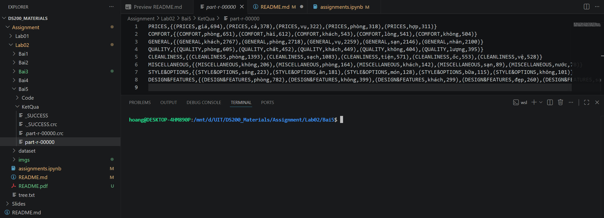
</div>