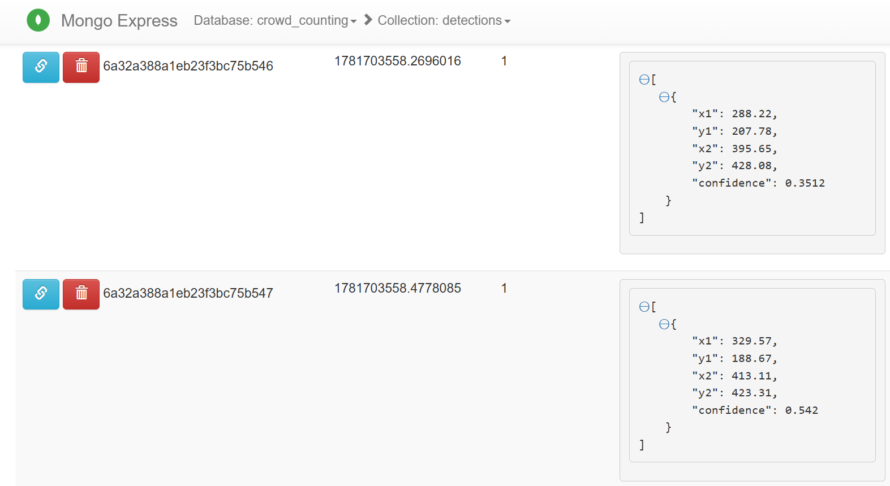

# Lab 05 — Real-time People Counting System

## Đề bài

Xây dựng hệ thống đếm số lượng người hiện diện trong một camera theo thời gian thực, bao gồm:

- **Ingestion Server**: Đọc các khung hình từ video/camera, encode và gửi lên message broker.
- **Processing Server**: Nhận khung hình, chạy mô hình nhận diện đối tượng (YOLOv8), lọc kết quả chỉ lấy người (`class_id = 0`), trả về bounding box và số lượng người.
- **Storage**: Lưu kết quả (timestamp, số người, tọa độ bbox) vào cơ sở dữ liệu.

---

## Tech Stack

| Thành phần | Công nghệ |
|---|---|
| Ingestion Server | Python, OpenCV, kafka-python-ng |
| Processing Server | Python, YOLOv8 (Ultralytics), PyTorch CPU |
| Message Broker | Apache Kafka (KRaft mode, không cần Zookeeper) |
| Database | MongoDB |
| Database UI | mongo-express |
| Container | Docker, Docker Compose |

---

## Folder Structure

```
Lab05/
├── docker-compose.yml              # Orchestrate 5 containers
├── README.md
├── data/
│   └── people_walking_video.mp4   # Video đầu vào
└── code/
    ├── ingestion-server/           # [SERVER 1] Đọc video, push frame lên Kafka
    │   ├── Dockerfile
    │   ├── requirements.txt
    │   └── src/
    │       ├── __init__.py
    │       ├── main.py             # Vòng lặp đọc video, gửi frame
    │       └── producer.py         # Encode JPEG → Base64 → Kafka
    │
    └── processing-server/          # [SERVER 2] Kéo frame, chạy YOLO, lưu DB
        ├── Dockerfile
        ├── requirements.txt
        ├── config.py               # Cấu hình KAFKA_URL, MONGO_URL, paths
        ├── weights/
        │   └── yolov8n.pt          # YOLOv8 Nano pre-trained weights
        └── src/
            ├── __init__.py
            ├── main.py             # Consumer loop: nhận frame → detect → lưu DB
            ├── detector.py         # YOLO inference, filter class_id=0
            └── db_client.py        # pymongo client, insert vào MongoDB
```

---

## Workflow

```
┌─────────────────┐     Kafka topic      ┌──────────────────┐     pymongo      ┌──────────┐
│  ingestion-srv  │ ── camera-frames ──> │   process-srv    │ ──────────────>  │ MongoDB  │
│                 │                      │                  │                  │          │
│ 1. Đọc video    │                      │ 1. Decode Base64 │                  │ {        │
│ 2. Encode JPEG  │                      │ 2. YOLO predict  │                  │  ts,     │
│ 3. Base64       │                      │ 3. Filter người  │                  │  count,  │
│ 4. Push Kafka   │                      │ 4. Insert DB     │                  │  bboxes  │
└─────────────────┘                      └──────────────────┘                  │ }        │
                                                                               └──────────┘
                                                                                    ↑
                                                                             mongo-express
                                                                             localhost:8081
```

**Luồng dữ liệu chi tiết:**

1. `ingestion-srv` dùng OpenCV đọc từng frame của video, encode sang JPEG rồi Base64, đóng gói JSON `{frame, timestamp}` push lên Kafka topic `camera-frames`.
2. `process-srv` consume message từ Kafka, decode Base64 → numpy array → đưa vào YOLOv8n. Chỉ giữ lại detection có `class_id = 0` (người).
3. Kết quả `{timestamp, person_count, bboxes}` được ghi thẳng vào MongoDB collection `crowd_counting.detections`.

---

## Cách chạy

### Yêu cầu

- Docker Desktop đang chạy
- File `code/processing-server/weights/yolov8n.pt` phải tồn tại

Tải weights (~6.5MB) nếu chưa có:

```bash
# Dùng Python
python -c "from ultralytics import YOLO; YOLO('yolov8n.pt')"
cp yolov8n.pt code/processing-server/weights/

# Hoặc dùng curl
curl -L -o code/processing-server/weights/yolov8n.pt \
  https://github.com/ultralytics/assets/releases/download/v8.2.0/yolov8n.pt
```

### Build & chạy

```bash
cd Assignment/Lab05

# Lần đầu (build image, mất 5–10 phút)
docker compose up --build

# Các lần sau
docker compose up
```

### Kiểm tra hệ thống

| Mục đích | Lệnh / URL |
|---|---|
| MongoDB UI | http://localhost:8081 |
| Log real-time của process-srv | `docker compose logs -f process-srv` |
| Đếm số record đã lưu | `docker exec mongodb mongosh crowd_counting --eval "db.detections.countDocuments()"` |
| Xem trạng thái containers | `docker compose ps` |

### Dừng hệ thống

```bash
docker compose down
```

---

## Cấu trúc dữ liệu MongoDB

Collection: `crowd_counting.detections`

```json
{
  "_id": "ObjectId(...)",
  "timestamp": 1781703558.478,
  "person_count": 2,
  "bboxes": [
    { "x1": 120.5, "y1": 80.2, "x2": 210.3, "y2": 350.8, "confidence": 0.8921 },
    { "x1": 430.1, "y1": 95.0, "x2": 520.6, "y2": 360.2, "confidence": 0.7643 }
  ]
}
```

## Kết quả

<div align="center">
    
    <br>
    <i> Data được lưu vào MongoDB sau khi xử lí dữ liệu (các frame ảnh) </i>
</div>

---

## Lưu ý kỹ thuật

- **Kafka KRaft mode**: Không cần Zookeeper. Container `kafka` tự khởi tạo cluster single-node. `ingestion-srv` và `process-srv` chờ Kafka `healthy` trước khi khởi động (healthcheck).
- **PyTorch CPU only**: `requirements.txt` của `process-srv` dùng `--extra-index-url https://download.pytorch.org/whl/cpu` để chỉ tải bản CPU (~200MB thay vì ~1GB CUDA).
- **Video loop**: Khi video phát hết, `ingestion-srv` tự quay lại frame đầu để chạy liên tục.
- **Frame sampling**: Chỉ gửi 5 frame/giây (không phải toàn bộ FPS gốc) để giảm tải Kafka và processing-server.
